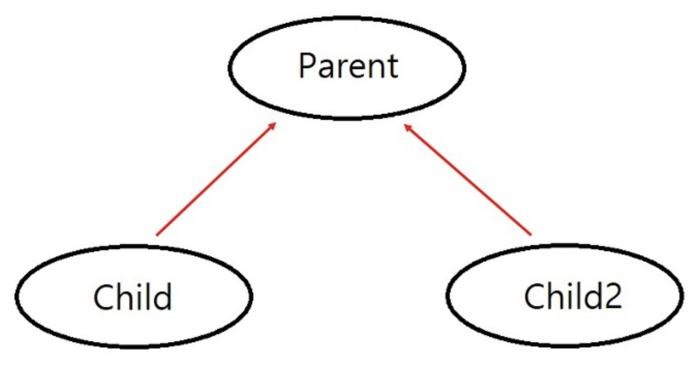

# 객체지향 
"객체지향은 실세계를 직접적이고 직관적으로 모델링 할 수 있는 패러다임" 이다. 이 말이 어떤 뜻을 의미할까?
이 설명이 담고 있는 뜻은 객체지향 프로그래밍이란 현실 속에 존재하는 사물을 최대한 유사하게 모방해 소프트웨어 내부로 옮겨오는 작업이기 때문에 그 결과물인 객체지향 소프트웨어는 실세계의 투영이며, 객체란 현실 세계에 존재하는 사물에 대한 추상화라는것.

## 객체지향 언어의 특징
#### 1. 코드의 재사용성이 높다.
새로운 코드 작성시 기존의 코드 이용해 쉽게 작성
#### 2. 코드의 관리가 용이하다.
코드간의 관계를 이용해 적은 노력으로 쉽게 코드 변경
#### 3. 신뢰성이 높은 프로그래밍을 가능하게 한다.
제어자와 메서드를 이용해 데이터를 보호하고, 코드의 중복을 제거해 코드의 불일치로 인한 오작동 방지

## 클래스
객체를 정의해 놓은 틀 혹은 객체의 설계도 또는 틀 이라고 정의 할 수 있다. 객체는 클래스에 정의된대로 생성된다. 클래스와 객체를 실생활의 예로 들어본다면 클래스는 제품설계도 객체는 제품이 될것이다. 즉, 클래스를 잘 만들어 놓으면 객체를 생성하는 일은 쉬워진다. 클래스로부터 객체를 생성해서 사용하면 된다.

## 인스턴스 
클래스로부터 객체를 만드는 일을 클래스의 인스턴스화(instantiate)라고 하고, 어떤 클래스로부터 만들어진 객체를 그 클래스의 인스턴스(instance)라고 한다. 결국 인스턴스와 객체는 같은 의미를 가지지만 객체는 모든 인스턴스를 대표하는 포괄적인 의미를 갖고 있고, 인스턴스는 보다 구체적인 의미를 가지고 있다. 예를 들어 보면, 책상은 객체다 라고 더 많이 쓰며 책상은 클래스의 인스턴스다라는 말을 더 많이 쓴다.

## 상속(inheritance)
상속이란 기존의 클래스를 재사용해서 새로운 클래스를 작성하는 것  
상속을 통해 클래스 작성시 보다 적은 양의 코드로 새로운 클래스 작성할 수 있게 된다. 이런 특징으로 코드의 재사용성을 높이고 코드의 중복을 제거해 프로그램의 생산성과 유지보수에 기여 

```java
class Child extends Parent{
    ///
}
```
이렇게 자바에서는 extends와 함께 써주면 된다. 이 두 클래스는 상속 관계에 있다고 하고 상속해 주는 클래스를 Parent Clas(조상 클래스), 상속 받는 클래스를 Child Class(자식 클래스)라고 한다. 

### 상속은 어떨때 유용하게 쓰일까?

이렇게 Child와 Child2 모두 Parent class를 상속 받고 있으므로 Parent class 와 Child class 그리고 Parent class와 Child2 class모두 서로 상속 관계에 있다. 만약 Child클래스와 Child2클래스에 공통적으로 추가되야 하는 부분이 있으면 Parent class에 추가 시킬 수 있다. 두 클래스에 따로 코드를 추가 시킬 필요가 없어 지고 Parent만 변경하면 되니 작업이 간단해 진다. 그리고 더 중요하게 코드의 중복이 줄어든다. 
> 코드의 중복이 많아지면 유지보수가 어렵고 일관성 유지가 힘듬


### 상속 코드 예시

```java

class Tv {

   boolean power; // 전원상태 (on / off)
   int channel;   // 채널

   void power()       {   power = !power; }
   void channelUp()   {   ++channel;      }
   void channelDown() {   --channel;      }
}

class CaptionTv extends Tv {

   boolean caption;     // 캡션상태 (on / off)
   
   void displayCaption(String text) {
       if (caption) {   // 캡션 상태가 on (true) 일 때만 text를 보여준다.
           System.out.println(text);
       }
   }
}

class CaptionTvTest {

   public static void main(String [] args) {
       CaptionTv ctv = new CaptionTv();
       ctv.channel = 10;                          // 조상 클래스로부터 상속받은 멤버
       ctv.channelUp();                           // 조상 클래스로부터 상속받은 멤버
       System.out.println(ctv.channel);
       ctv.displayCaption("Hello, World");
       ctv.caption = true;          // 캡션 (자막) 기능을 켠다.
       ctv.displayCaption("Hello, World");
   }
}

```

### 다형성(Polymorphism)
객체지향에서 다형성이란 '여러가지 형태를 가질 수 있는 능력'을 의미하며, 자바에서는 한 타입의 참조변수로 여러 타입의 객체를 참조할 수 있도록 함으로써 다형성을 프로그램적으로 구현했다. 조금 더 자세히 말하면, 조상클래스 타입의 참조변수로 자손 클래스의 인스턴스를 참조할 수 있도록 했다는 의미이다.  

상속에서 본 코드 예시에서 두 클래스의 인스턴스를 생성하기 위해서 인스턴스 타입과 일치하는 참조변수만 사용했었다. 
```java
Tv t = new Tv();
CaptionTv c = new CaptionTv();
```

하지만, Tv클래스와 CaptionTV클래스는 서로 상속관계에 있어, 조상 클래스 타입의 참조변수로 자손 클래스의 인스턴스를 참조하도록 하는 것도 가능하다.
```java
Tv t = new CaptionTv();
```

반대로 자손타입의 참조변수로 조상 클래스의 인스턴스를 참조하도록하는것은 불가능하다.

<!-- 여기 어떻게 달라지는지 예시 추가 -->

### 추상화(Abstraction)
클래스를 설계도에 비유하면, 추상클래스는 미완성 설계도에 비유할 수 있다. 추상클래스는 미완성 설계도이기에 이 클래스 만으로 인스턴스를 생성하는 것은 가능하지 않다. 추상클래스는 상속을 통해서 자손 클래스에 의해서 완성이 될 수 있다.

추상클래스는 미완성 메소드(추상 메서드)를 포한하고 있다는 것을 제외하고는 일반 클래스와 같다. 

#### 추상 메서드
메서드 선언만 한채 구현을 하지 않은채로 남겨둔 메서드

#### 추상클래스 예시 코드
```java
abstract class Player { // 추상 클래스
	abstract void play(int pos); // 추상 메서드
    abstrct void stop(); // 추상 메서드
}
class AudioPlayer extends Player {
	void play(int pos) { /*내용 생략*/ } // 추상 메서드를 구현
    void stop() { /*내용 생략*/ } // 추상 메서드를 구현
}
abstract class AbstractPlayer extends Player {
	void play(int pos)  { /*내용 생략*/ } // 추상 메서드를 구현
}
```

### 캡슐화
객체의 속성(data fields)과 행위(메서드, methods)를 하나로 묶고,
실제 구현 내용 일부를 외부에 감추어 은닉한다.객체가 외부에 노출되지 않아야할 정보를 접근제어자를 통해 제어 권한이 있는 객체에서만 접근할 수 있도록 한다. 
